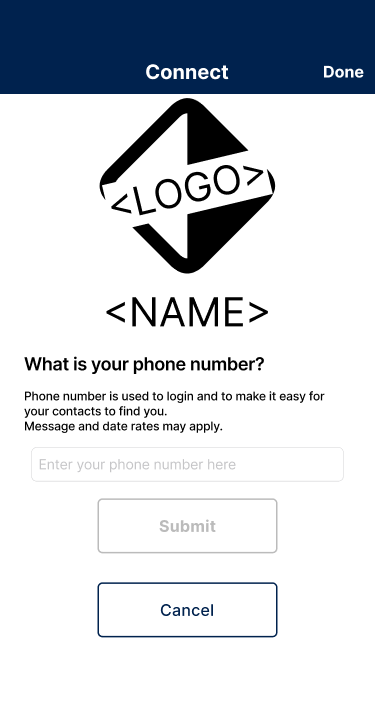
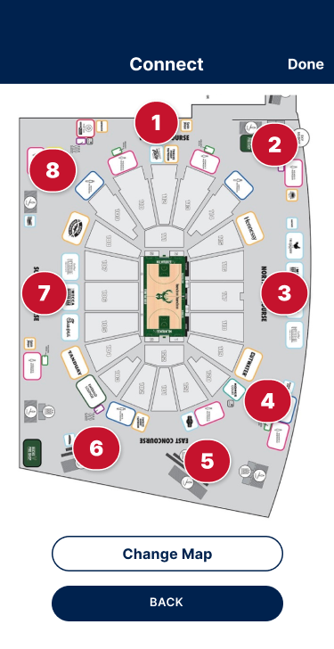
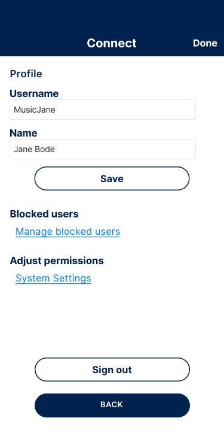

# User Experience for the bLinkup SDK

The UI provides users a way to find each other in the app and meet up in real life at your events. The UI is passed a few arguments which ensures the look and feel matches your app. You will provide:

1. Primary Color (#00224e blue in this example)
2. Secondary Color (#c5132d red in this example)
3. Logo (optional)

> If the logo is not provided then content will shift up to fill the space.

Data such as the GPS coordinates and size of radius for locations, bLinkpoints, promotional images, and text is all managed through the customer backend portal.

## Users will sign in with their phone number and authenticate through a one time code they will get texted to their phone

## The main view will be lists of friends who are present at the same location, all friends, and friend requests

## Add friends though a text search or by connecting your contacts to quickly add friends

## Each location will have a map and bLinkPoints where users can easily send a message to their friends to meet up

The red color background is the secondary color chosen when the UI is initialized.

## Users will be able to manage their own profiles and other details from the profile page

